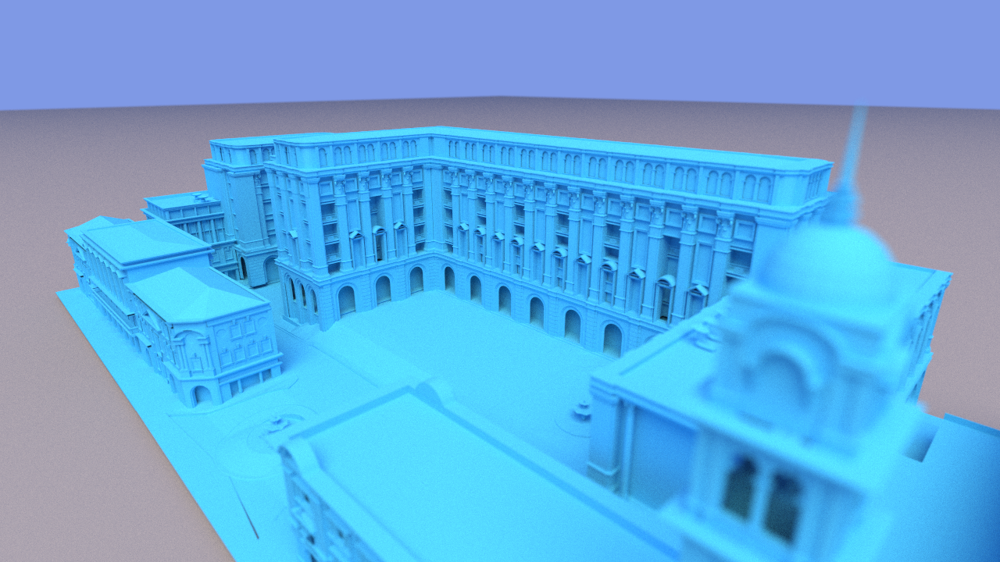
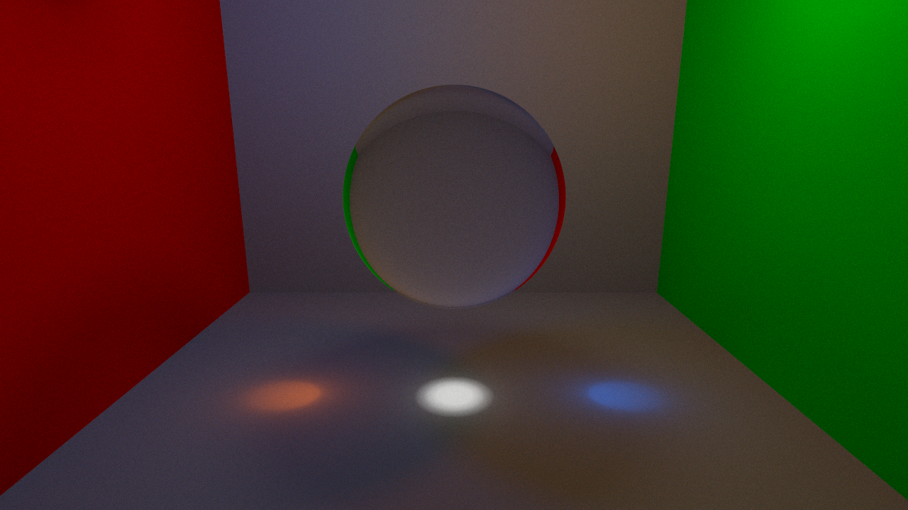
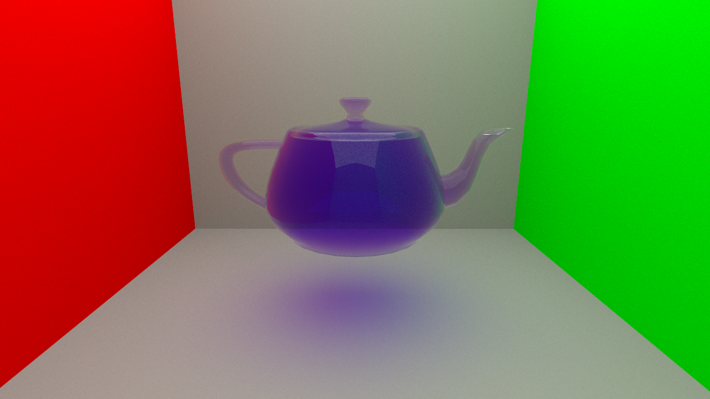
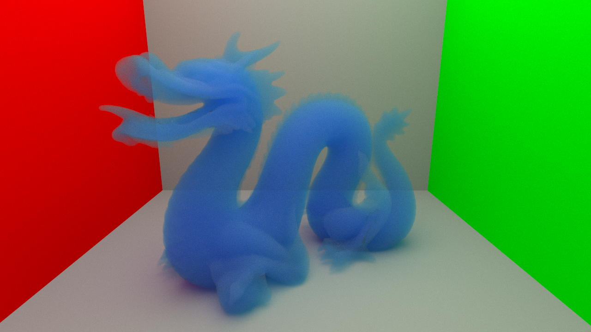

# dino
Path-tracing GPU rendering engine.

### About

dino was developed as a final project developed for RIT's Global Illumination class. It is a toy implementation of the path tracing algorithm from Kajiya's The Rendering Equation paper. It has been extended to include visual effects from Cook et al.'s Distributed Ray Tracing paper (with modifications to work with path tracing. Rendering happens entirely on a GPU using Nvidia's CUDA API, and images are progressively refined and displayed in an interactive window.

### Features

- unidirectional path Tracing
- sphere primitives, and basic .obj file loading
- BVH spatial partitioning structures for models
- Phong PDFs with importance sampling for diffuse and specular shading
- perfect reflection, glossy reflection, transparency, translucency, refraction
- Beer's law attenuation, subsurface scattering with Henyey-Greenstein phase function
- depth of field
- interactive camera

### Controls

- W, A, S, D keys for basic camera movement
- R and F move the camera up and down
- T and G update the focal distance (Depth of Field)
- Alternatively, right clicking in the scene updates the focal distance to the selected object.
- Y and H change the camera aperture size
- C resets the render buffer
- P pauses the renderer
- O saves the rendered image, prompting for a file name
- Shift + O saves the rendered image with a timestamp as the file name.
- Q quits the application
